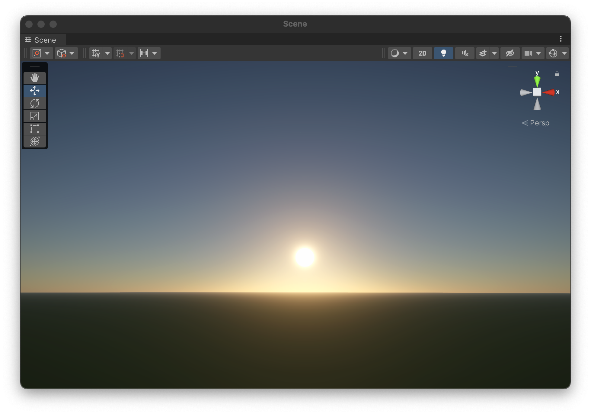

# Rendering demo of URP

This is a demo project of URP including many insteresting topics.

# Atmosphere

## Sky dome

The atmosphere part is the same as what's in UE5, with precomputed lookup table every frame. Which means that every parameters of the atmosphere can change in realtime to create some extreme weather.

## Eclipse

when sun and moon collapse with each other, the atmosphere should change accordingly, there is solar eclipse. (lunar eclipse not implemented yet)

## Starry night

starry night need a lot of stars and the milkway. I take 500 most bright stars from HIP star table and draw them on the sky. They are not precomputerd but in real-time, you can change the position or color in the star structure file. The milkway and the constellation is taken form the stellarium.

The moon is also drawn in real time according to the position of the sun.

That means, all the stars and moon and sun are strictly drawn the same as in reality. You can change the time (and time zone) to get the sky of any day (I've checked the correctness with stellarium)

## The earth

From the deep sky, the earth is very beautiful. So I also add this feature. All the textures come from NASA, including the cloud and the night earth. The atmosphere is still in function when far away.

## The star trace

People like to do this kind of photo very much, but why we do not make it in the virtual world? Every thing is controllable and the same as the real world.

# Basic rendering

In the normal rendering part, I basically imitate what Genshin do in the game with a fully deferred pipeline (charaters are actually rendered in a "forward" way).

## Anime style

From characters to buildings, they are all like Genshin. I implement the rim light, ramp map, face shadow...

## parallax

I also add the parallax texture which I think is very important to improve the visual appearance in anime game.

## PCSS

I add the PCSS and TAA in this project, but it is actually quite slow and not very good. (But the soft shadow in unity HDRP is also not good...)

## Many light

It is supported natively by HDRP but not in URP. So I add it by some custom compute shader. In this way I can support hundreds of lights in one scene.

The algorhthm is the standard froxel lighting.

# Credits

1. Models from MiHoYo

https://genshin.hoyoverse.com/ja/news/detail/104561

2. The Hipparcos star catalog

From ESA (European Space Agency) and the Hipparcos mission.

ref. ESA, 1997, The Hipparcos and Tycho Catalogues, ESA SP-1200

http://cdsweb.u-strasbg.fr/ftp/cats/I/239

3. Earth textures from NASA.

https://visibleearth.nasa.gov/collection/1484/blue-marble

https://www.nasa.gov/multimedia/guidelines/index.html

4. Milkway and Moon textures from Stellarium

License for the JPL planets images

http://www.jpl.nasa.gov/images/policy/index.cfm

5. Constellation information from Stellarium

https://github.com/Stellarium/stellarium/blob/master/CREDITS.md

6. Atmosphere rendering

https://github.com/sebh/UnrealEngineSkyAtmosphere
